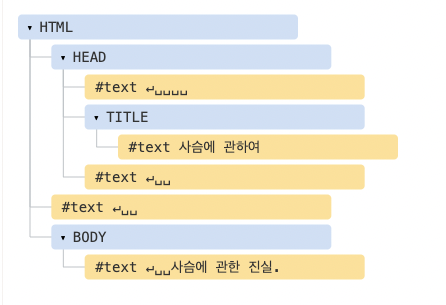

# DOM 트리
HTML을 지탱하는 것은 **태그(tag)** 이다.

DOM에 따르면, 모든 HTML 태그는 **객체**이다.

> ex) `document.body` 는 `<body\>` 태그를 객체로 나타낸 것이다.

### DOM 예제
간단한 문서를 통해 DOM 구조에 대해 알아보자.

```html
<!DOCTYPE HTML>
<html>
<head>
  <title>사슴에 관하여</title>
</head>
<body>
  사슴에 관한 진실.
</body>
</html>
```



태그들은 모두 객체로 표현된다.

태그는 **요소 노드** 이고, 트리 구조를 구성한다. 

`html` 은 루트 노드가 되고, `head` 와 `body`는 루트 노드의 자식이 된다.

요소 내의 문자는 텍스트 노드가 된다. 

> ex) `<title\>` 태그는 `"사슴에 관하여"` 라는 텍스트 노드를 자식으로 갖는다.

공백이나 개행은 어떻게 처리될까?
- 개행(newline): ↵(자바스크립트에선 \n로 표시)
- 공백(space): ␣

개행(newline)과 공백은 글자나 숫자처럼 항상 유효한 문자로 취급된다.

텍스트 생성에는 두가지 예외가 있다.

1. 역사적인 이유로, `<head>` 이전의 공백과 개행은 무시된다.

2. HTML 명세서에서 모든 콘텐츠는 body 안 쪽에 있어야 한다고 했으므로, `</body\>` 뒤에 무언가를 넣는다 하더라도 그 콘텐츠는 자동으로 body 안쪽으로 옮겨진다.

### 자동교정

- 만약 `안녕하세요` 라는 문장 하나만 html에 저장하더라도, 브라우저가 자동으로 문장을 html과 body로 감싸준다. 거기에 head도 더해서 태그를 구성하게 된다.

- 닫는 태그가 없는 경우
  - 태그 짝이 안맞아도 브라우저는 태그를 읽고 자동으로 빠진 부분을 채워 넣어준다.

### 기타 노드
- HTML 안의 모든 것은 (심지어 그것이 주석이더라도) DOM을 구성한다.
- 문서 전체를 나타내는 document 객체 또한 DOM 노드이다.

**노드 타입 (in the wild)**
- DOM의 진입점인 문서(document) 노드
- HTML 태그에서 만들어지며, DOM 트리를 구성하는 블록인 요소 노드(element node)
- 텍스트를 포함하는 텍스트 노드(text node)
- 화면에 보이지는 않지만, 정보를 기록하고 JS를 사용해 이 정보를 DOM으로부터 읽을 수 있는 주석(comment) 노드
  
